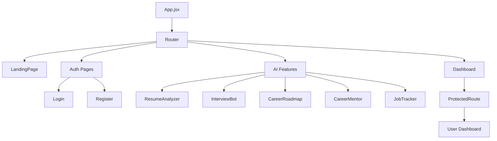

# CareerMentor.AI - Frontend Documentation

<div align="center">


[](https://reactjs.org/)
[](https://tailwindcss.com/)
[](https://www.framer.com/motion/)

*Modern, AI-powered career development interface*

</div>

---

## 🌟 Overview

The **CareerMentor.AI Client** is a cutting-edge React frontend that provides an intuitive, visually stunning interface for career development tools. Built with modern web technologies, it delivers a seamless user experience with smooth animations, responsive design, and AI-powered interactions.

### 🎯 Design Philosophy
- **User-Centric Design**: Intuitive navigation and clean UI/UX
- **Modern Aesthetics**: Dark gradient themes with glassmorphism effects
- **Performance-First**: Optimized loading and smooth animations
- **Accessibility**: WCAG compliant with keyboard navigation support

---

## ✨ Platform Capabilities

### 🤖 AI-Powered Features

| Feature | Description | User Experience |
|---------|-------------|-----------------|
| **📝 AI Resume Optimizer** | Upload and analyze resumes instantly | Drag-and-drop interface with real-time feedback display |
| **🎤 Smart Interview Coach** | Practice role-specific mock interviews | Interactive chat-like interface with AI responses |
| **🗺️ Career Roadmap Generator** | Create personalized learning paths | Visual roadmap with milestone tracking |
| **👔 24/7 Career Mentor** | Get instant career advice | Conversational AI interface with natural language input |
| **📋 Smart Job Tracker** | Manage job applications intelligently | Kanban-style board with status tracking and analytics |

### 🎨 User Interface Features

- **🌙 Modern Dark Theme** with purple-pink gradient accents
- **✨ Smooth Animations** powered by Framer Motion
- **📱 Fully Responsive** design for all screen sizes
- **🎭 Glassmorphism Effects** for premium visual appeal
- **⚡ Fast Loading** with optimized asset delivery
- **🔐 Secure Authentication** with JWT token management

---

## 🏗️ Architecture & Structure

### Project Organization

```
src/
├── 📁 components/              # Reusable UI Components
│   ├── 📄 Navbar.jsx          # Navigation component
│   ├── 📄 Footer.jsx          # Footer component
│   ├── 📄 LoadingSpinner.jsx  # Loading states
│   └── 📄 ProtectedRoute.jsx  # Route protection
├── 📁 pages/                  # Main Application Pages
│   ├── 📄 LandingPage.jsx     # Homepage with feature showcase
│   ├── 📄 Dashboard.jsx       # User dashboard
│   ├── 📄 Login.jsx           # Authentication - Sign in
│   ├── 📄 Register.jsx        # Authentication - Sign up
│   ├── 📄 About.jsx           # About page
│   ├── 📄 ResumeAnalyzer.jsx  # Resume upload & analysis
│   ├── 📄 InterviewBot.jsx    # Mock interview interface
│   ├── 📄 CareerRoadmap.jsx   # Roadmap generation
│   ├── 📄 CareerMentor.jsx    # AI mentor chat
│   └── 📄 JobTracker.jsx      # Job application tracker
├── 📁 context/                # React Context Providers
│   └── 📄 AuthContext.js      # Authentication state management
├── 📁 hooks/                  # Custom React Hooks
│   ├── 📄 useAuth.js          # Authentication hook
│   ├── 📄 useLocalStorage.js  # Local storage management
│   └── 📄 useAPI.js           # API interaction hook
├── 📁 utils/                  # Utility Functions
│   ├── 📄 api.js              # Axios configuration
│   ├── 📄 constants.js        # App constants
│   └── 📄 helpers.js          # Helper functions
├── 📁 assets/                 # Static Assets
│   ├── 📁 images/             # Images and icons
│   └── 📁 fonts/              # Custom fonts
├── 📁 styles/                 # Global Styles
│   ├── 📄 globals.css         # Global CSS rules
│   └── 📄 animations.css      # Custom animations
├── 📄 App.jsx                 # Main application component
└── 📄 index.js                # Application entry point
```

### Component Hierarchy



---

## 🎨 Design System

### Color Palette

```css
/* Primary Gradients */
--gradient-primary: linear-gradient(135deg, #667eea 0%, #764ba2 100%);
--gradient-secondary: linear-gradient(135deg, #f093fb 0%, #f5576c 100%);
--gradient-dark: linear-gradient(135deg, #0f172a 0%, #7c3aed 50%, #0f172a 100%);

/* Accent Colors */
--purple-400: #a855f7;
--pink-400: #f472b6;
--cyan-400: #22d3ee;
--blue-400: #60a5fa;

/* Semantic Colors */
--success: #10b981;
--warning: #f59e0b;
--error: #ef4444;
--info: #3b82f6;
```

### Typography Scale

```css
/* Headings */
.text-8xl  { font-size: 6rem; }     /* Hero titles */
.text-5xl  { font-size: 3rem; }     /* Page titles */
.text-3xl  { font-size: 1.875rem; } /* Section titles */
.text-xl   { font-size: 1.25rem; }  /* Card titles */

/* Body Text */
.text-base { font-size: 1rem; }     /* Default text */
.text-sm   { font-size: 0.875rem; } /* Supporting text */
.text-xs   { font-size: 0.75rem; }  /* Captions */
```

### Animation Patterns

```javascript
// Entrance Animations
const fadeInUp = {
  hidden: { opacity: 0, y: 60 },
  visible: { opacity: 1, y: 0, transition: { duration: 0.6 } }
};

// Stagger Children
const staggerContainer = {
  hidden: { opacity: 0 },
  visible: {
    opacity: 1,
    transition: { staggerChildren: 0.1 }
  }
};

// Hover Effects
const hoverScale = {
  whileHover: { scale: 1.05 },
  whileTap: { scale: 0.95 }
};
```

---

## 🚀 Getting Started

### Prerequisites

```bash
Node.js >= 16.0.0
npm >= 8.0.0
```

### Installation & Setup

1. **Clone the repository**
   ```bash
   git clone https://github.com/srcvision/CareerMentor.AI.git
   cd CareerMentor.AI/client
   ```

2. **Install dependencies**
   ```bash
   npm install
   ```

3. **Environment Configuration**
   
   Create `.env` file in client root:
   ```env
   # API Configuration
   REACT_APP_API_URL=http://localhost:5000
   REACT_APP_API_TIMEOUT=10000
   
   # Feature Flags
   REACT_APP_ENABLE_VOICE_INPUT=true
   REACT_APP_ENABLE_DARK_MODE=true
   
   # Analytics (Optional)
   REACT_APP_GOOGLE_ANALYTICS_ID=your-ga-id
   ```

4. **Start Development Server**
   ```bash
   npm start
   ```
   
   Application will be available at: http://localhost:3000

5. **Build for Production**
   ```bash
   npm run build
   ```

---

## 🛠️ Development Workflow

### Available Scripts

```json
{
  "start": "react-scripts start",           // Development server
  "build": "react-scripts build",           // Production build
  "test": "react-scripts test",             // Run tests
  "eject": "react-scripts eject",           // Eject from CRA
  "lint": "eslint src/",                    // Code linting
  "format": "prettier --write src/",       // Code formatting
  "analyze": "npm run build && npx webpack-bundle-analyzer build/static/js/*.js"
}
```

### Code Quality Tools

- **ESLint**: Code linting with React best practices
- **Prettier**: Consistent code formatting
- **Husky**: Git hooks for pre-commit validation
- **Lint-staged**: Run linters on staged files only

---

## 📱 Responsive Design

### Breakpoint System

```css
/* Mobile First Approach */
sm:   640px   /* Small devices (landscape phones) */
md:   768px   /* Medium devices (tablets) */
lg:   1024px  /* Large devices (laptops) */
xl:   1280px  /* Extra large devices (desktops) */
2xl:  1536px  /* 2X Large devices (large desktops) */
```

### Component Responsiveness

```jsx
// Example responsive component
<div className="
  grid 
  grid-cols-1 
  md:grid-cols-2 
  lg:grid-cols-3 
  gap-4 
  md:gap-6 
  lg:gap-8
">
  {/* Responsive grid items */}
</div>
```

---

## 🔧 State Management

### Authentication Context

```javascript
// AuthContext provides user state across app
const AuthContext = createContext();

export const AuthProvider = ({ children }) => {
  const [user, setUser] = useState(null);
  const [loading, setLoading] = useState(true);
  
  // Authentication methods
  const login = async (credentials) => { /* */ };
  const logout = () => { /* */ };
  const register = async (userData) => { /* */ };
  
  return (
    <AuthContext.Provider value={{ user, login, logout, register, loading }}>
      {children}
    </AuthContext.Provider>
  );
};
```

### Local State Patterns

```javascript
// Custom hooks for component state
export const useFormInput = (initialValue) => {
  const [value, setValue] = useState(initialValue);
  const onChange = (e) => setValue(e.target.value);
  return { value, onChange, setValue };
};

// API data fetching
export const useAPI = (endpoint) => {
  const [data, setData] = useState(null);
  const [loading, setLoading] = useState(true);
  const [error, setError] = useState(null);
  
  useEffect(() => {
    fetchData();
  }, [endpoint]);
  
  return { data, loading, error, refetch: fetchData };
};
```

---

## 🎭 Animation Guidelines

### Motion Principles

1. **Purposeful**: Every animation serves a functional purpose
2. **Consistent**: Same duration and easing across similar interactions
3. **Performant**: Use transform and opacity for smooth 60fps animations
4. **Accessible**: Respect user's motion preferences

### Common Animation Patterns

```javascript
// Page transitions
const pageVariants = {
  initial: { opacity: 0, x: -200 },
  in: { opacity: 1, x: 0 },
  out: { opacity: 0, x: 200 }
};

// Loading states
const loadingSpinner = {
  animate: { rotate: 360 },
  transition: { duration: 1, repeat: Infinity, ease: "linear" }
};

// Micro-interactions
const buttonTap = {
  whileTap: { scale: 0.95 },
  whileHover: { scale: 1.05 }
};
```

---

## 🧪 Testing Strategy

### Test Structure

```
src/__tests__/
├── 📁 components/        # Component unit tests
├── 📁 pages/            # Page integration tests
├── 📁 hooks/            # Custom hook tests
├── 📁 utils/            # Utility function tests
└── 📄 setupTests.js     # Test configuration
```

### Testing Examples

```javascript
// Component testing with React Testing Library
import { render, screen, fireEvent } from '@testing-library/react';
import { AuthProvider } from '../context/AuthContext';
import Login from '../pages/Login';

test('renders login form and handles submission', async () => {
  render(
    <AuthProvider>
      <Login />
    </AuthProvider>
  );
  
  const emailInput = screen.getByPlaceholderText(/email/i);
  const submitButton = screen.getByRole('button', { name: /sign in/i });
  
  fireEvent.change(emailInput, { target: { value: 'test@example.com' } });
  fireEvent.click(submitButton);
  
  // Assert expected behavior
});
```

---

## 🚀 Performance Optimization

### Optimization Techniques

1. **Code Splitting**: Route-based lazy loading
   ```javascript
   const Dashboard = lazy(() => import('./pages/Dashboard'));
   ```

2. **Image Optimization**: WebP format with fallbacks
   ```jsx
   <picture>
     <source srcSet="image.webp" type="image/webp" />
     
   </picture>
   ```

3. **Bundle Analysis**: Regular bundle size monitoring
   ```bash
   npm run analyze
   ```

4. **Memoization**: Prevent unnecessary re-renders
   ```javascript
   const MemoizedComponent = memo(({ data }) => {
     return <div>{data.title}</div>;
   });
   ```

### Performance Targets

- **First Contentful Paint**: < 1.5s
- **Largest Contentful Paint**: < 2.5s
- **Cumulative Layout Shift**: < 0.1
- **Time to Interactive**: < 3.5s

---

## 📦 Deployment

### Build Process

```bash
# Create optimized production build
npm run build

# Serve build locally for testing
npx serve -s build
```

### Environment-Specific Configurations

```javascript
// Different API endpoints for environments
const API_BASE_URL = {
  development: 'http://localhost:5000',
  staging: 'https://api-staging.careermentor.ai',
  production: 'https://api.careermentor.ai'
}[process.env.NODE_ENV];
```

---

## 🤝 Contributing

### Code Style Guidelines

1. **Component Structure**
   ```jsx
   // 1. Imports
   import React, { useState, useEffect } from 'react';
   import { motion } from 'framer-motion';
   
   // 2. Component definition
   export default function MyComponent({ prop1, prop2 }) {
     // 3. Hooks
     const [state, setState] = useState(null);
     
     // 4. Event handlers
     const handleClick = () => { /* */ };
     
     // 5. Effects
     useEffect(() => { /* */ }, []);
     
     // 6. Render
     return (
       <motion.div>
         {/* JSX */}
       </motion.div>
     );
   }
   ```

2. **Naming Conventions**
   - Components: PascalCase (`UserProfile`)
   - Files: PascalCase for components (`UserProfile.jsx`)
   - Functions: camelCase (`handleSubmit`)
   - Constants: UPPER_SNAKE_CASE (`API_BASE_URL`)

3. **CSS Classes**
   - Use Tailwind utility classes
   - Group related classes logically
   - Use responsive prefixes consistently

### Pull Request Process

1. **Create Feature Branch**
   ```bash
   git checkout -b feature/new-feature-name
   ```

2. **Development & Testing**
   - Write unit tests for new components
   - Ensure responsive design works
   - Test accessibility with screen readers

3. **Code Review Checklist**
   - [ ] Components are properly typed
   - [ ] Responsive design implemented
   - [ ] Animations are smooth and purposeful
   - [ ] Tests pass and have good coverage
   - [ ] No console errors or warnings

---

## 📚 Resources & References

### Documentation Links

- [React Documentation](https://reactjs.org/docs)
- [Tailwind CSS Documentation](https://tailwindcss.com/docs)
- [Framer Motion Documentation](https://www.framer.com/motion/)
- [React Router Documentation](https://reactrouter.com/)
- [Axios Documentation](https://axios-http.com/docs/intro)

### Design Resources

- [Tailwind UI Components](https://tailwindui.com/)
- [Heroicons](https://heroicons.com/)
- [Radix UI Primitives](https://www.radix-ui.com/)
- [Headless UI](https://headlessui.com/)

### Development Tools

- [React Developer Tools](https://chrome.google.com/webstore/detail/react-developer-tools)
- [Tailwind CSS IntelliSense](https://marketplace.visualstudio.com/items?itemName=bradlc.vscode-tailwindcss)
- [ES7+ React/Redux/React-Native snippets](https://marketplace.visualstudio.com/items?itemName=dsznajder.es7-react-js-snippets)

---

## 📄 License

This project is licensed under the MIT License - see the [LICENSE](../LICENSE) file for details.

---

<div align="center">

**Built with ❤️ using React, Tailwind CSS, and Framer Motion**

[](https://github.com/srcvision/CareerMentor.AI)

</div>
